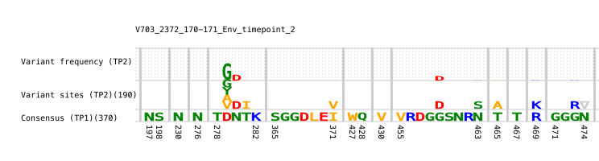

# EscapeLogos

This repository provides a `Julia` script to generate an escape logo 
from a curated amino acid alignment.



### Installing Julia (version 1.10.5)

We recommend you use the `juliaup` version manager to install julia.
from a terminal you can do this as follows:

```bash
curl -fsSL https://install.julialang.org | sh
```

This should install the Julia version manager, `juliaup` as well as
the latest version of Julia. To find out how to use the version manager 
to makesure you have version 1.10.5 as your default, go here:

[https://github.com/JuliaLang/juliaup]

Once Julia is installed, make sure you can enter the julia REPL from 
the command line and check the version number by logging out and in again 

```bash
exit
ssh root@.....
```

and then from your new terminal session:

```bash
juliaup status
julia --version
```

If the version number is not 1.10.5 then you need to use `juliaup` to install
that version and make it the default. 

```bash
juliaup add 1.10.5
juliaup default 1.10.5
```

for further details concerning `juliaup` go here:

[https://github.com/JuliaLang/juliaup?tab=readme-ov-file#using-juliaup]

### cloning the EscapeLogos repository

Now that `Julia` is setup we clone the `EscapeLogos` repository

```bash
git clone https://github.com/HughMurrell/EscapeLogos.git
```

### setting up the Julia package environment

then navigate to the `EscapeLogos` directory and start the 
Julia REPL. 

Enter the package manager using `]` and then enter

```julia
activate .
instantiate
precompile
```

This will activate, install, and precompile the `julia` environment
specified by the  `Project.toml` and `Manifest.toml` files. 
The `precompile` command above is not strictly needed but is useful 
if there are issues with installing the `julia` packages listed in
`Project.toml`

### preparing your alignments

Place your curated AA alignments as fasta files in the alignments directory. 

The first sequence in each fasta file must be the reference sequence
to which the epitope cordinates in the script refer.

The second sequence in each fasta file should be a sequence from which
**escape** is estimated. We use a consensus of the first timepoint for
this sequence.

All other sequence identifiers in each fasta file should be annotated by
appending the text `_tpn` where `n` is the single digit timepoint for 
that sequence. In our case we use `_tp1` for the first timepoint and 
`_tp2` for the second timepoint. You can have up to 9 timepoints.

### running the script

to run the script, type

```julia
julia escapelogos.jl
```
and the script will parse the alignments in the `alignments` directory 
and the resulting `svg` logo for each timepoint will appear in the
`logos` directory.

alternatively, you can specify input and output directories as follows:

```julia
julia escapelogos.jl alignment_directory logo_directory
```

### modifying the script

To modify the script, use any text editor. For example you may want to
create your own epitope coordinates. To do this, towards the end of the
script you will find definitions for the default epitope and two others.
Use the same structure to define your own epitope and then set the **ept**
variable accordingly.

Also, we have a filter available for **gappy** sequences. You can set 
the `GAPPY_CUTOFF` constant in the script to suit your requirements.

### citation

The AA alignments and logos found in this repository are discussed in
one of the following papers:

<a id="1">[1]</a> 
Willanson et. al. (2025). 
Post-acquisition VRC01 escape mechanisms in antibody-mediated prevention:
Implications for next generation CD4-broadly neutralizing antibodies and 
HIV vaccine design,
*in preparation*.

If you make use of this script in your work, please cite one of these papers.
